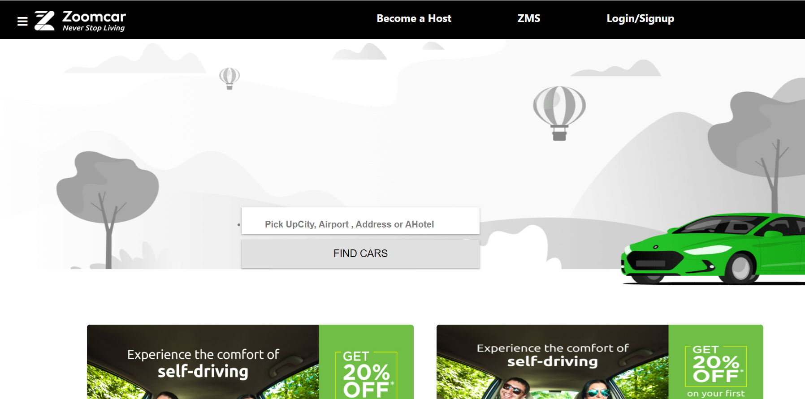
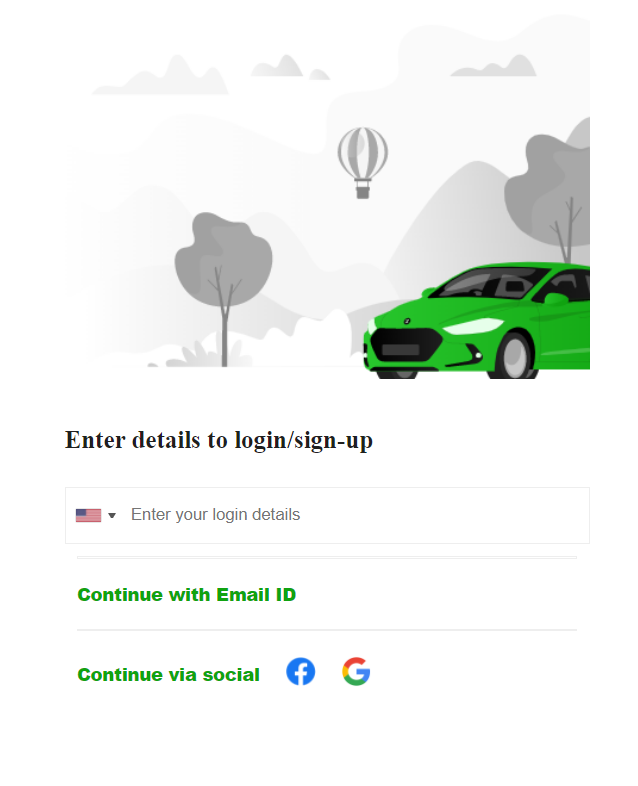
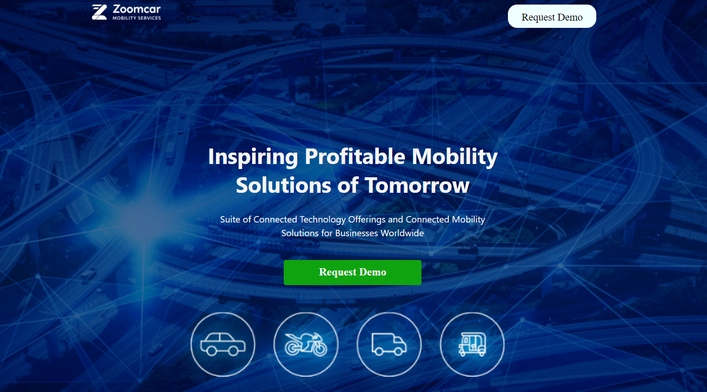
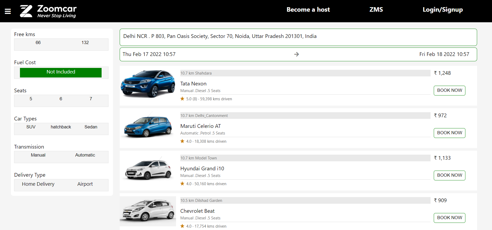
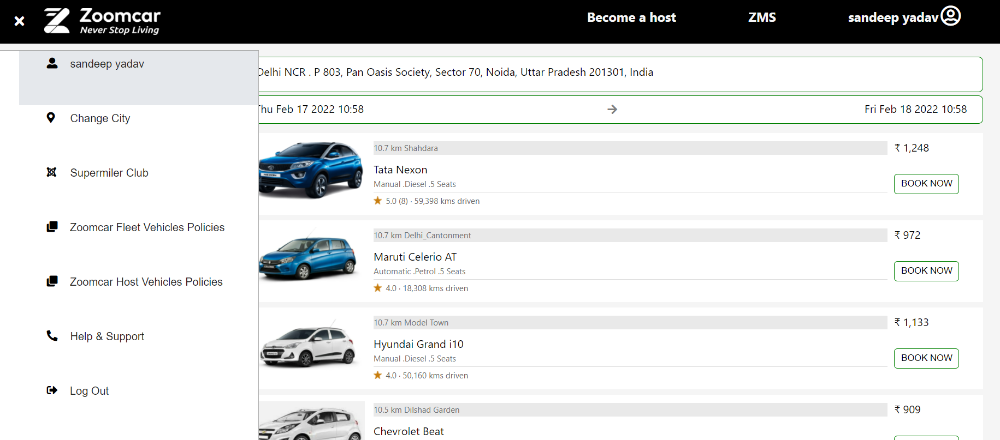
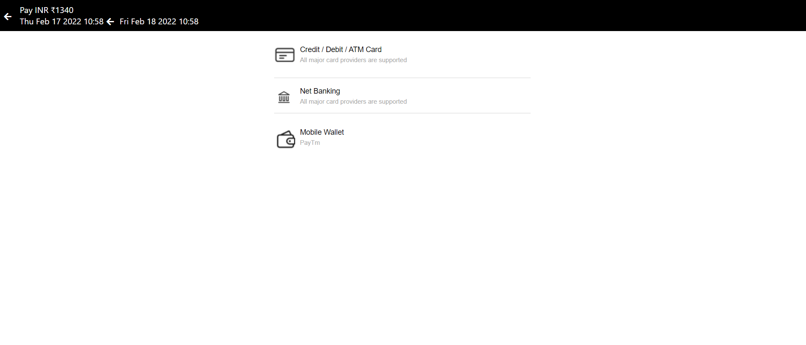

<h1><a href="http://3.82.160.93:2345/home" target="_blank">Zoomcar-Clone Project</a></h1>
<h2>To start using app: "npm run start"</h2>
<h2> Tack Stack used: </h2>

 To create this project following Tech Stacks are used by our team.

<ul>
 <li> EJS </li>
 <li> CSS </li>
 <li> JavaScript </li>
 <li> Redis </li>
 <li> MongoDB Atlas</li>
 <li> express </li>
 <li> Deployed on aws </li>
</ul>

 <h2> Landing Page/HomePage: </h2>
 
 
 
 <h2> SignIn Page:</h2>
 

 <h2> Become a host:</h2>
 
 
 <h2> ZMS:</h2>
 

<h2> Products Page:</h2>
 

 <h2> Sidebar:</h2>
 

 <h2> Checkout:</h2>
 

 <h2>Team Members and Contributors: </h2>
 <h3>Sandeep</h3>
 <ul>
 <li>GitHub: <a href="https://github.com/Raosandeep007">Raosandeep007</a> </li>
 <li>E-mail: <a href="mailto:yadavsandeep775@gmail.com">yadavsandeep775@gmail.com</a></li>
 <li>Linkedin: <a href="https://www.linkedin.com/in/sandeep-yadav-828779149/" rel="nofollow">Sandeep Yadav</a></li>
 </ul>

 <h3>Arundhathi</h3>
 <ul>
 <li>GitHub: <a href="https://github.com/arundhathi6"> arundhathi6</a></li>
 <li>E-mail: <a href="mailto:arundhathi6menon@gmail.com">arundhathi6menon@gmail.com</a></li>
 <li>Linkedin: <a href="https://www.linkedin.com/in/arundhathi6/" rel="nofollow">Arundhathi</a></li>
 </ul>

 <h3>Akshay Kumar</h3>
 <ul>
 <li>GitHub: <a href="https://github.com/Akshay-Kumar2000">Akshay-Kumar2000 </a></li>
 <li>E-mail: <a href="mailto:kumarakshay809177@gmail.com">kumarakshay809177@gmail.com</a></li>
 <li>Linkedin: <a href="https://www.linkedin.com/in/akshay-kumar-018970189/" rel="nofollow">Akshay kumar</a></li>
 </ul>

 <h3>Shashi Kumar</h3>
 <ul>
 <li>GitHub: <a href="https://github.com/shashifw11">shashifw11 </a></li>
 <li>E-mail: <a href="mailto:Shekhar.shashi735@gmail.com">Shekhar.shashi735@gmail.com</a></li>
 <li>Linkedin: <a href="https://www.linkedin.com/in/shashi-kumar-0a4835150/" rel="nofollow">Shashi kumar</a></li>
 </ul>
